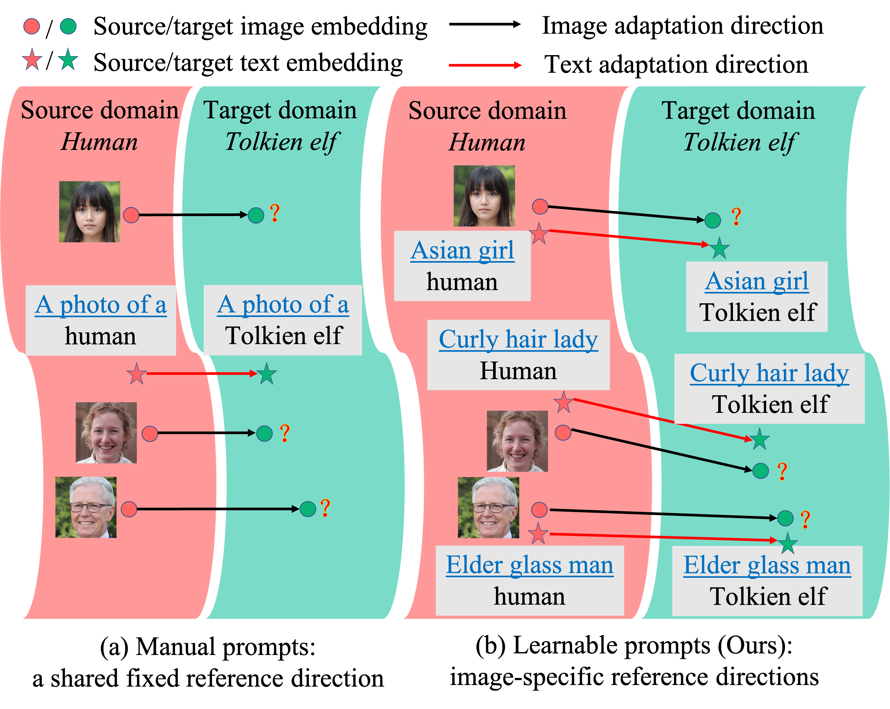
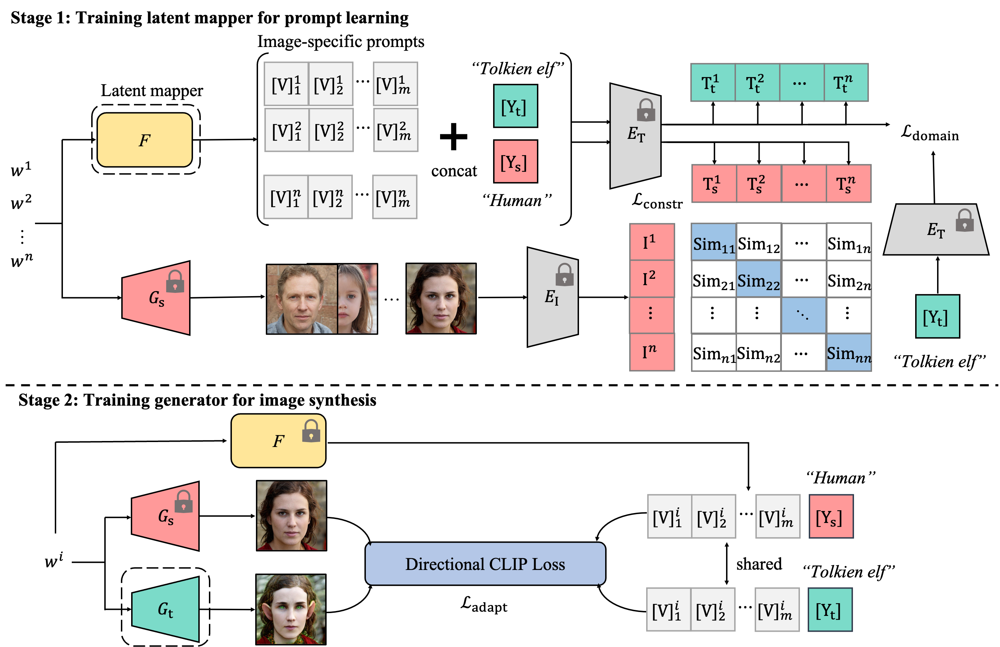

# IPL-Zero-Shot-Generative-Model-Adaptation

This repository is the official Pytorch implementation for [IPL](https://arxiv.org/pdf/2304.03119.pdf).

[](https://openaccess.thecvf.com/content/CVPR2023/papers/Guo_Zero-Shot_Generative_Model_Adaptation_via_Image-Specific_Prompt_Learning_CVPR_2023_paper.pdf) [](https://arxiv.org/abs/2304.03119) [](https://youtu.be/vw9-C3Sz5nM)

**[Zero-shot Generative Model Adaptation via Image-specific Prompt Learning](https://arxiv.org/pdf/2304.03119.pdf) (CVPR 2023)**
</br>
[Jiayi Guo](https://www.jiayiguo.net)\*,
[Chaofei Wang](https://scholar.google.com/citations?user=-hwGMHcAAAAJ&hl=en&oi=ao)\*,
You Wu,
Eric Zhang,
Kai Wang,
[Xingqian Xu](https://scholar.google.com/citations?user=s1X82zMAAAAJ&hl=en&oi=ao),
[Shiji Song](https://scholar.google.com/citations?user=rw6vWdcAAAAJ&hl=en&oi=ao),
[Humphrey Shi](https://www.humphreyshi.com),
[Gao Huang](https://www.gaohuang.net)
</br>
 
> **Abstract**: 
> Recently, CLIP-guided image synthesis has shown appealing performance on adapting a pre-trained source-domain generator to an unseen target domain. It does not require any target-domain samples but only the textual domain labels. The training is highly efficient, e.g., a few minutes. However, existing methods still have some limitations in the quality of generated images and may suffer from the mode collapse issue. 
A key reason is that a fixed adaptation direction is applied for all cross-domain image pairs, which leads to identical supervision signals. To address this issue, we propose an **I**mage-specific **P**rompt **L**earning (IPL) method, which learns specific prompt vectors for each source-domain image. This produces a more precise adaptation direction for every cross-domain image pair, endowing the target-domain generator with greatly enhanced flexibility. 
Qualitative and quantitative evaluations on various domains demonstrate that IPL effectively improves the quality and diversity of synthesized images and alleviates the mode collapse. Moreover, IPL is independent of the structure of the generative model, such as generative adversarial networks or diffusion models. 
<p align="center">
</p>

## News
- Update on 2023/04/30: Release code and models. 

## Overview

We propose a two-stage method named **I**mage-specific **P**rompt **L**earning (IPL) for generative model adaptation via only a text domain label. 
In Stage 1, a latent mapper is trained to produce a set of image-specific prompt vectors for each latent code of a source-domain image. In Stage 2, the trained latent mapper is plugged into the training process of the target-domain generator, and produces more precise and diversified adaptation directions for cross-domain image pairs. Our IPL largely addressed the mode collapse issue that appeared in existing works.
<p align="center">
</p>

## Usage

### Dependencies
Clone this repo and install required packages:
```
git clone https://github.com/Picsart-AI-Research/IPL-Zero-Shot-Generative-Model-Adaptation.git
conda create -n ipl python=3.8
conda activate ipl
pip install torch==1.8.0+cu111 torchvision==0.9.0+cu111 torchaudio==0.8.0 -f https://download.pytorch.org/whl/torch_stable.html
pip install ftfy regex tqdm ninja
pip install git+https://github.com/openai/CLIP.git
```
Pretrained **source** StyleGAN2 generators can be downloaded (via [Google Drive](https://drive.google.com/drive/folders/1FW8XfDbTg9MLEodEeIl6zJEaCVyZ053L?usp=sharing) or [Tsinghua Cloud](https://cloud.tsinghua.edu.cn/d/dbd0955d9a9547dc99f2/)) and placed in a `pre_stylegan` folder.
```
mkdir pre_stylegan
```

### Example commands
To adapt a generator of "photo" domain to "disney" domain, run the following script:
```
CUDA_VISIBLE_DEVICES=0 python train.py  --frozen_gen_ckpt ./pre_stylegan/stylegan2-ffhq-config-f.pt \
                                        --source_model_type "ffhq" \
                                        --output_interval 300 \
                                        --save_interval 300 \
                                        --auto_compute \
                                        --source_class "photo" \
                                        --target_class "disney" \
                                        --run_stage1 \
                                        --batch_mapper 32 \
                                        --lr_mapper 0.05 \
                                        --iter_mapper 300 \
                                        --ctx_init "a photo of a" \
                                        --n_ctx 4 \
                                        --lambda_l 1 \
                                        --run_stage2 \
                                        --batch 2 \
                                        --lr 0.002 \
                                        --iter 300 \
                                        --output_dir ./output/disney
```

To generate samples using a adapted generator, run the following script:
```
CUDA_VISIBLE_DEVICES=0  python eval.py  --frozen_gen_ckpt ./pre_stylegan/stylegan2-ffhq-config-f.pt \
                                        --adapted_gen_ckpt ./adapted_generator/ffhq/disney.pt \
                                        --source_model_type "ffhq" \
                                        --auto_compute \
                                        --output_dir ./eval/disney
```


## Results

Corresponding generators are available at [Google Drive](https://drive.google.com/drive/folders/1UZlwmNUgukoD8LwwWOA2QfcrEjUtbWYo?usp=sharing) and [Tsinghua Cloud](https://cloud.tsinghua.edu.cn/d/54a0cdaf8d33400dbc67/).

<p align="center">
</p>

## Citation

If you find our work helpful, please **star🌟** this repo and **cite📑** our paper. Thanks for your support!

```
@InProceedings{Guo_2023_CVPR,
    author    = {Guo, Jiayi and Wang, Chaofei and Wu, You and Zhang, Eric and Wang, Kai and Xu, Xingqian and Song, Shiji and Shi, Humphrey and Huang, Gao},
    title     = {Zero-Shot Generative Model Adaptation via Image-Specific Prompt Learning},
    booktitle = {Proceedings of the IEEE/CVF Conference on Computer Vision and Pattern Recognition (CVPR)},
    month     = {June},
    year      = {2023},
    pages     = {11494-11503}
}
```

## Acknowledgments

Our implementation is mainly based on [StyleGAN-NADA](https://github.com/rinongal/StyleGAN-nada) and [CoOp](https://github.com/KaiyangZhou/CoOp). We thank to their clean codebases.

## Contact
guo-jy20 at mails dot tsinghua dot edu dot cn


